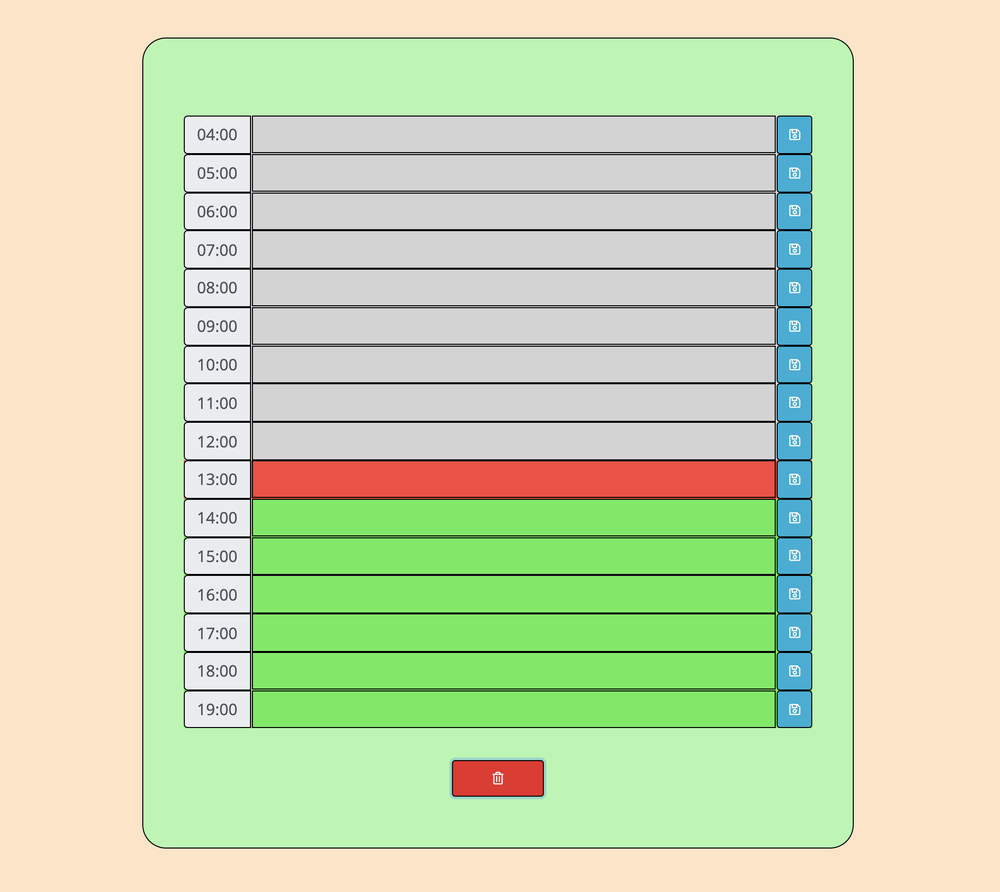
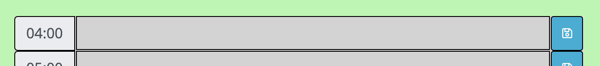

# Work Day Scheduler

## Completed by Michael Shaw 
## UWA Coding Bootcamp

This Work Day Scheduler was created for a homework assignment for UWA's coding bootcamp.

This application makes use of JavaScript to display a calendar where users can save and delete their events.



### Getting Started

This project has been deployed to GitHub Pages. To use the calendar, you can follow the deployment link. Or, download the source files to use this as a template.

* [Deployed GitHub IO](https://michaelshxw.github.io/Work-Day-Scheduler/)
* [GitHub Repository](https://github.com/michaelshxw/Work-Day-Scheduler)

### Prerequisites
To install this application, a text editor such as Visual Studio Code is required. This can be downloaded [here.](https://code.visualstudio.com/download)

### Languages Used
* HTML 
* CSS
* JavaScript

### Installation
To install this code, download the zip file, or use GitHub's guidelines to clone the repository

### Summary
* This Work Day Scheduler uses HTML, CSS and JavaScript to display a calendar. Once the user has entered their events, they can save them to localStorage. If they would like to delete them, they can delete them from localStorage. Events entered by the user will remain saved even if they close the browser.
* This project highlights the use of JavaScript to make dynamic changes to a HTML document.


### Project Features
* A calendar container
    * This is the entire calendar area where users can interact with the calendar.


* A Input Area
    * This area is where the user inputs their events into the calendar. It features the time of day, a textarea input and a save button



* A Delete / Clear button
    * This button is used to clear all of the saved events in localStorage. It has a confirm alert attached to it that runs before events are deleted for user safety.


    
### Project Requirements 

Below is the acceptance criteria that was given for the homework assignment
```
GIVEN I am using a daily planner to create a schedule
WHEN I open the planner
THEN the current day is displayed at the top of the calendar
WHEN I scroll down
THEN I am presented with timeblocks for standard business hours
WHEN I view the timeblocks for that day
THEN each timeblock is color coded to indicate whether it is in the past, present, or future
WHEN I click into a timeblock
THEN I can enter an event
WHEN I click the save button for that timeblock
THEN the text for that event is saved in local storage
WHEN I refresh the page
THEN the saved events persist
```

### Authors
* **Michael Shaw** (HTML, CSS and JavaScript) [GitHub Profile](https://github.com/michaelshxw)
* **Trilogy Education Services** (Some HTML and CSS was provided by Trilogy Education Services, most of it has been modified)
